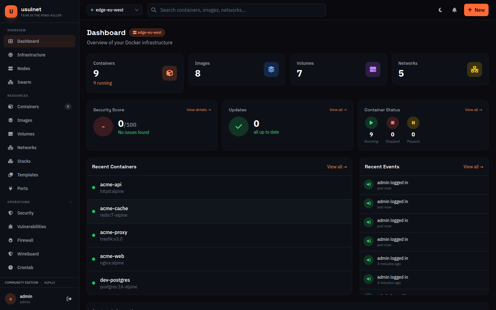
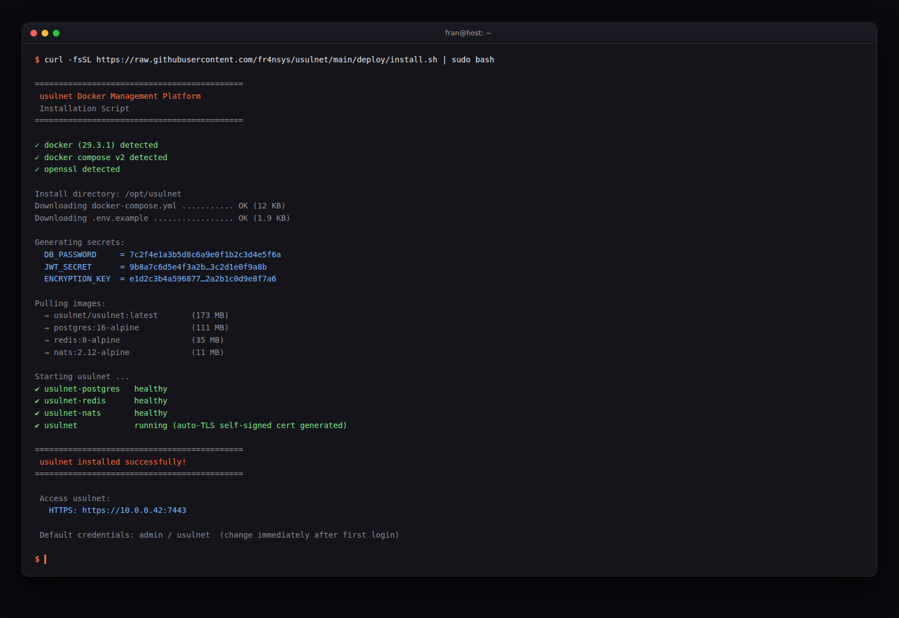
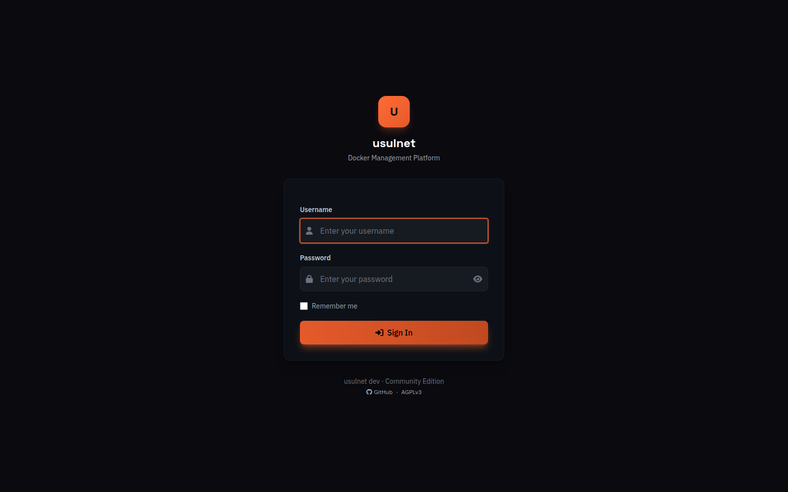
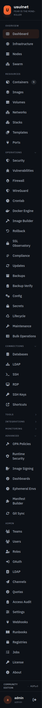
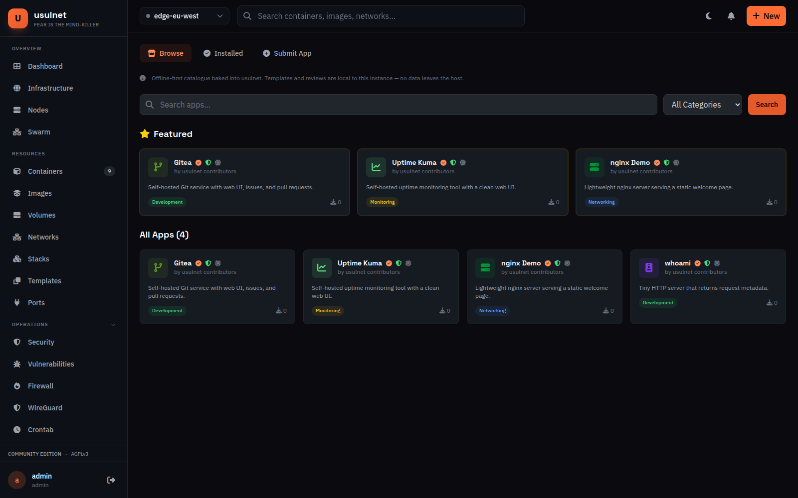
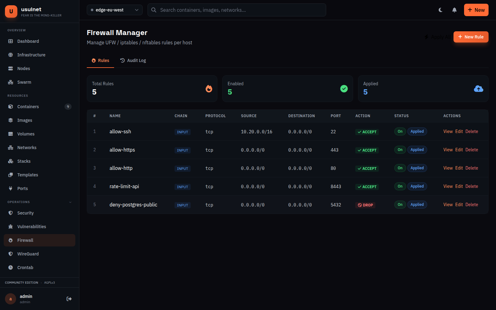
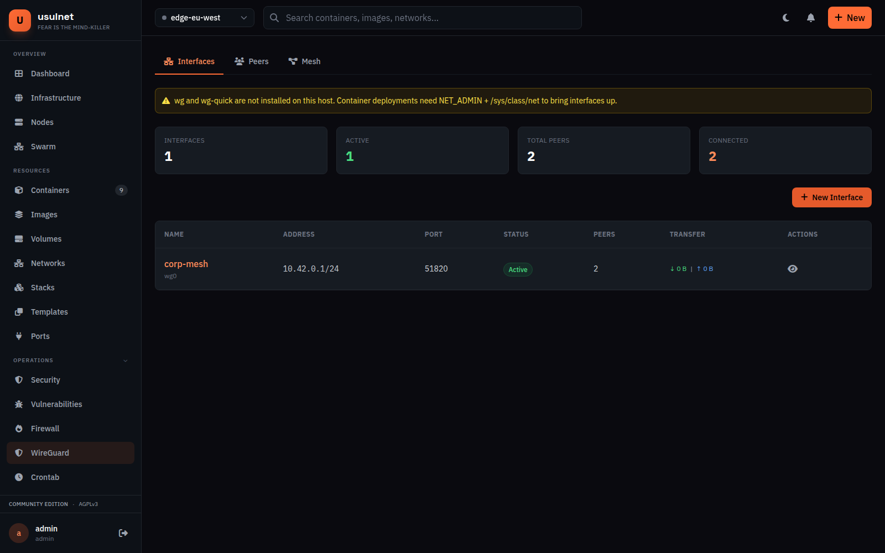
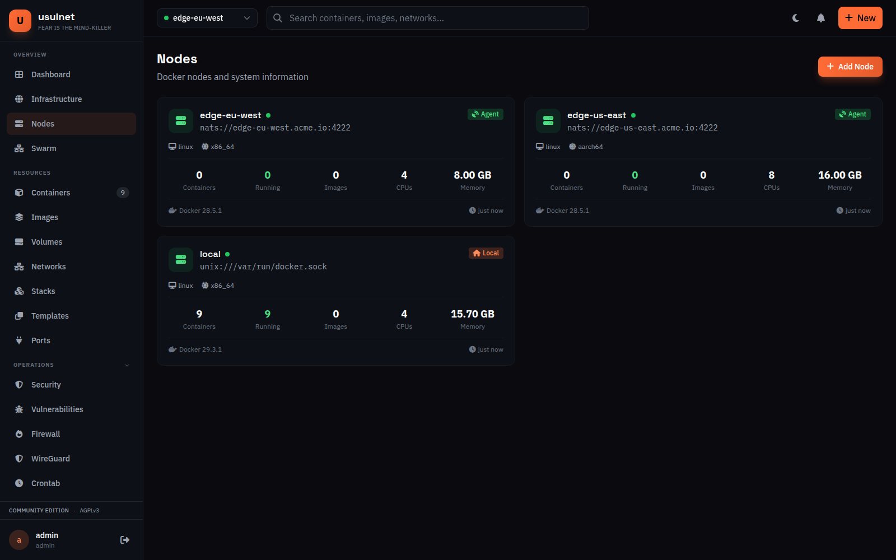
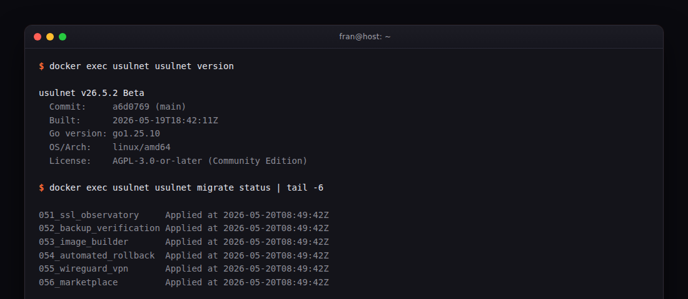
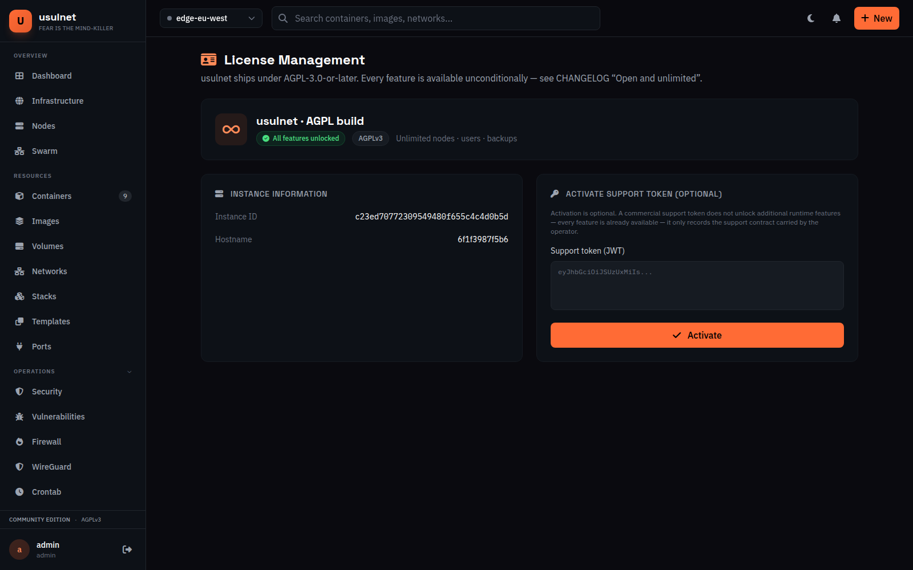

# usulnet

Self-hosted Docker management plane with built-in privacy tooling. Single
Go binary, AGPL-3.0, one build — every feature in this repo ships in the
standard binary, no edition gating, no call-home.

[](go.mod)
[](LICENSE)
[](https://github.com/fr4nsys/usulnet/releases)

usulnet runs container lifecycle, security scanning, backups,
reverse-proxy configuration, monitoring, multi-node orchestration, host
infrastructure tooling (firewall, crontab, WireGuard mesh, docker-engine
config, image builder), and an opt-in privacy module (OSINT recon plus
file metadata hygiene) from a single process on hardware you own.

v26.5.2 Beta — released 2026-05-19. Bug reports:
[issues](https://github.com/fr4nsys/usulnet/issues). Release notes:
[`CHANGELOG.md`](CHANGELOG.md) and
[`docs/v26.5.2/release-notes.md`](docs/v26.5.2/release-notes.md)
(v26.5.1 archive:
[`docs/v26.5/release-notes-v26.5.1.md`](docs/v26.5/release-notes-v26.5.1.md)).



## Quick start

```bash
curl -fsSL https://raw.githubusercontent.com/fr4nsys/usulnet/main/deploy/install.sh | sudo bash
```

The installer pulls the production compose file, generates the database
password, JWT secret, AES-256 data-encryption key, and a self-signed TLS
cert. It prints the access URL when ready.



Open `https://<host>:7443`, log in as `admin` / `usulnet`, then change
the password from the profile page.



Manual Docker Compose install, standalone binary install, and offline
procedures live in [`docs/installation.md`](docs/installation.md).

## What's new in v26.5.2

Polish release on top of v26.5.1. **No database migration.** Adds the
Shodan recon connector to the AGPL binary (second BYO-key external
connector after HIBP), ports `usulnet-agent` to Cobra with `run` /
`version` / `validate-config` subcommands and a canonical
`USULNET_AGENT_DOCKER_HOST` env var, lands global CLI `--quiet` /
`--json` flags with a JSON error envelope, adds `migrate up` /
`down [N]` / `status` subcommands, ships header / sidebar / modal /
flash a11y landmarks across the web chrome, bakes shell tab-completion
into both production Docker images, and publishes a new operator CLI
reference at [`docs/cli.md`](docs/cli.md). Per-feature detail in
[`docs/v26.5.2/release-notes.md`](docs/v26.5.2/release-notes.md);
full per-PR changelog in `[v26.5.2]` of
[`CHANGELOG.md`](CHANGELOG.md).

## What's in v26.5.1

Eleven modules previously gated behind the Business edition now ship in
the standard AGPL build, plus a proxy-extended enhancement and the
opt-in local-services TLS dispatcher. Per-feature detail in
[`docs/v26.5/release-notes-v26.5.1.md`](docs/v26.5/release-notes-v26.5.1.md);
full per-migration audit in `[v26.5.1]` of
[`CHANGELOG.md`](CHANGELOG.md).



| Module | What it does |
| --- | --- |
| **Calendar** | Operations calendar with manual events plus read-only aggregation of backup runs and scheduled jobs; RFC 5545 `.ics` export. |
| **Proxy extended** | Access lists, dead hosts, locations, redirections, streams. Authoritative state in PostgreSQL; backend feature matrix surfaced via `GET /api/v1/proxy/support`. |
| **DNS** | Provider plugins for Cloudflare, AWS Route 53, DigitalOcean, RFC 2136. ACME DNS-01 state machine that survives restarts. Credentials AES-256-GCM at rest. |
| **Crontab** | Managed shell / docker / http cron jobs scheduled via `robfig/cron/v3`. WebSocket live tail, paginated executions, body cap. |
| **Firewall** | UFW / nftables / iptables rule management over the existing host-management SSH transport. |
| **SSL observatory** | In-process TLS scanning, certificate health grading, per-target alert thresholds, SNI virtual-host scans, daily sweep. |
| **Backup verification** | Scheduled + on-demand restore tests in the sandboxed recon-launcher container. Real checksum + extract via the backup-service `Verify` pipeline. |
| **Image builder** | Local Dockerfile pipeline with live log streaming (Redis pub/sub + WebSocket/SSE), 256 MiB context cap, seven AGPL-compatible starter templates, optional cosign hook. |
| **Automated rollback** | Detects failed deploys via event-driven `changes.Service.Subscribe` and reverts to the last known-good stack version. Per-stack mutex, cooldown, dry-run preview, append-only Postgres-trigger audit log. |
| **WireGuard** | Peer + interface manager extended into a master→agent mesh over NATS. Real Curve25519 keys, AES-256-GCM at rest, one-time QR with 5-min TTL, per-agent mesh status page. |
| **Marketplace** | Curated app catalog baked into the binary via `go:embed`. Zero outbound HTTP at runtime. Local-only reviews. Installs wire through the stack service. |

Also in v26.5.1: the **docker-engine config** editor (atomic
`daemon.json` writes with snapshot history and reload-with-rollback —
no migration), the **sidebar edition cleanup** (all
`isEditionAvailable` / `RequireFeature` / `limitProvider` callsites
removed; `license.CELimits()` collapsed into `license.OpenLimits()`),
the **bootstrap restructure** (the 2,700-line `startStandalone` split
into phased `init_*.go` files), and **opt-in local-services TLS** via
`USULNET_TLS_LOCAL_SERVICES=true` for in-cluster Postgres / Redis /
NATS.

## Features

### Docker control plane

| Area | Capability |
| --- | --- |
| Containers | Full lifecycle (create / start / stop / restart / pause / kill / remove), bulk operations, real-time stats, exec terminal, log viewer, filesystem browser. |
| Images | Pull, inspect, prune, layer history; Docker Hub and private registries with encrypted credentials. |
| Image builder | Local Dockerfile build pipeline with live log streaming (Redis pub/sub + WebSocket/SSE), capped context uploads (256 MiB default), AGPL-compatible starter templates, optional cosign signing hook. |
| Volumes and networks | Create, inspect, prune, file browser; bridge / overlay / macvlan; connect and disconnect containers. |
| Stacks | Docker Compose deployments from YAML, Git repositories, or built-in catalogue. |
| Marketplace | Offline curated app catalog baked into the binary via `go:embed`; local-only reviews; install action drives an existing stack via templated docker-compose. |
| Swarm | Cluster init, node management, services, replica scaling, standalone-to-swarm conversion. |
| Multi-node | `standalone`, `master`, and `agent` modes; agent ↔ master traffic over NATS with mTLS; agent deploy from the UI via SSH. |
| Reverse proxy | Caddy and Nginx Proxy Manager adapters; Let's Encrypt with auto-renewal; TCP/UDP stream proxying. Extended state (access lists, dead hosts, locations, redirections, streams) authoritative in PostgreSQL with explicit backend support matrix. |
| DNS automation | Provider plugins for Cloudflare, AWS Route 53, DigitalOcean, and RFC 2136 nameservers; ACME DNS-01 state machine that survives restarts; credentials AES-256-GCM at rest. |
| Backups | Container / volume / stack targets; cron schedules with retention; gzip or zstd; local, S3, MinIO, Azure Blob, GCS, B2, SFTP. |
| Backup verification | Scheduled + on-demand restore tests in a sandboxed container (read-only rootfs, dropped caps, no-new-privileges, default seccomp); real checksum + extract via the backup-service `Verify` pipeline. |
| Automated rollback | Detects failed deploys via event-driven `changes` subscription and reverts to the last known-good stack version; per-stack mutex prevents racing manual deploys; cooldown window; dry-run preview; append-only audit log via Postgres trigger. |
| SSL observatory | In-process TLS scanning, certificate health grading, per-target alert thresholds, SNI virtual-host scans, daily scheduled sweep, expiry alerts routed via the notification service. |
| Monitoring | Per-container and per-host CPU / RAM / network / disk; threshold alerts with `OK → Pending → Firing → Resolved` state machine; 11 notification channels (Email, Slack, Discord, Telegram, Gotify, ntfy, PagerDuty, Opsgenie, Microsoft Teams, generic webhook, custom). |
| Logs and events | Aggregated container logs with search; Docker event stream with filtering; packet capture per network interface. |
| Vulnerabilities | Trivy CVE scans for images and filesystems; 0–100 security score per container and infrastructure-wide; SBOM in CycloneDX and SPDX; Docker CIS Benchmark checks. |
| Calendar | Operations calendar with manual events and read-only aggregation of backup runs + scheduled jobs; RFC 5545 `.ics` export. |



### Host & infrastructure tooling

| Area | Capability |
| --- | --- |
| Firewall | UFW / nftables / iptables rule management over the existing SSH host transport. Web UI + REST API; closed-enum validation; audit log of every apply. |
| Crontab | Managed cron jobs (shell, docker, http types) parsed with `robfig/cron/v3`; paginated executions; WebSocket live tail; HTTP body capped at 64 KiB. |
| Docker engine config | `/etc/docker/daemon.json` editor with atomic writes (temp + `fsync` + `rename`), snapshot history with rotation, and reload-with-rollback under a hard 60 s timeout. Monaco diff editor + history page. |
| WireGuard | Peer + interface manager extended into a master→agent mesh over the NATS gateway. Real Curve25519 keys, private/preshared keys AES-256-GCM at rest, one-time QR endpoint with 5-min TTL, per-agent mesh status page. |




### Capability requirements

The modules in the previous table reach the host through the existing
host-management transport or a bind mount. Capability requirements:

| Module | Needed |
| --- | --- |
| firewall | `NET_ADMIN` on the agent process; `ufw` / `nft` / `iptables` available on the host. |
| WireGuard | WireGuard kernel module + `wg` / `wg-quick` on each agent host; `NET_ADMIN` on the agent process; `USULNET_ENCRYPTION_KEY` set on the master. |
| docker-engine config | Host `/etc/docker` bind-mounted into the usulnet container as `:rw`. |
| image builder | Docker socket mount (already required by the platform). |
| backup verification | Docker socket mount (already required). |
| DNS providers | Outbound egress to each provider's API endpoint; `USULNET_ENCRYPTION_KEY` set. |

All other v26.5.1 modules (crontab, ssl-observatory, calendar,
marketplace, rollback, proxy-extended) need nothing beyond the default
compose stack. Full detail in
[`docs/installation.md`](docs/installation.md#capability-requirements-v2651-modules).

### Privacy and recon (opt-in)

Off by default — every recon route returns 404 until an admin sets
`USULNET_RECON_ENABLED=true` and records the legal-notice acknowledgement
(`POST /api/v1/recon/_ack`). Full design and threat model in
[`docs/recon.md`](docs/recon.md); signed review at
[`docs/v26.5/security-review-checklist.md`](docs/v26.5/security-review-checklist.md).


| Area | Capability |
| --- | --- |
| OSINT recon | SpiderFoot-driven passive scans against emails, domains, phones, IPs, usernames. Ownership is verified (DNS TXT, e-mail link, RDAP, admin-attest, self-assert) before a scan can start. |
| Scan profiles | Four built-in profiles plus full CRUD for user-defined profiles. Built-in rows are immutable; the module catalogue is closed. |
| Reports | Per-scan JSON, CSV, and paginated A4 PDF at `/api/v1/recon/scans/{id}/report.{json,csv,pdf}`. PDF is pure Go and byte-deterministic. |
| Metadata hygiene | `mat2` strip plus `exiftool` / `pdfid` / `oletools` extract. Each job runs in a fresh container with read-only rootfs, all Linux capabilities dropped, seccomp default, and PID / memory caps. |
| Sandbox network | Dedicated `usulnet-recon` Docker network with a strict egress allow-list (DNS, 80, 443 by default). |
| HIBP connector | Optional Have-I-Been-Pwned integration. Credentials AES-256-GCM at rest in `recon_connectors`; keys are never returned through the API or logs. |
| Retention | Daily prune of findings, scans, and audit log past the per-tenant TTL (default 90 days). Two-phase delete on metadata artifacts. |
| Audit | Append-only `recon_audit_log` records every state-changing action with actor, target, and request hash. |

### Auth, RBAC, platform

| Area | Capability |
| --- | --- |
| Authentication | JWT with configurable expiry; `X-API-KEY` for programmatic access; TOTP 2FA with backup codes; LDAP / Active Directory; OAuth2 / OIDC (GitHub, Google, Microsoft, custom). |
| Authorisation | RBAC with 44+ granular permissions, custom roles, team-based resource scoping. |
| Secrets | AES-256-GCM at rest for every sensitive value; bcrypt password hashing; configurable password complexity; account lockout. |
| Transport | TLS with auto-generated self-signed certs (or BYO); mTLS for inter-node messaging; configurable rate limiting; CSRF; secure cookie defaults. Opt-in local-services TLS for in-cluster Postgres / Redis / NATS via `USULNET_TLS_LOCAL_SERVICES=true`. |
| Audit | Per-user action log persisted to PostgreSQL with IP, timestamp, detail; CSV export. |
| Observability | Prometheus `/metrics` (admin-auth) including Go runtime and process metrics; OpenTelemetry instrumentation. |
| API | REST under `/api/v1`; OpenAPI 3.0 at `/api/v1/openapi.json`; Swagger UI at `/docs/api`; WebSocket streams for logs, exec, stats, events, metrics, packet capture, and nvim. |

### Developer tools

Web-based terminal hub (xterm.js) with container exec and host SSH.
Monaco editor and Neovim with `lazy.nvim` for in-browser file editing.
Filesystem browsers for containers, hosts, and SFTP. Snippets and cheat
sheets. Outgoing webhooks on container events with retry. Auto-deploy
rules triggered by Git push. Runbooks for multi-step operations.
Cron-scheduled jobs for backups, scans, metrics, update checks, recon
retention, and cleanup.

## Architecture

usulnet ships as a single binary that runs in one of three modes:

- `standalone` — one Docker host, all services local. NATS not required.
- `master` — `standalone` plus a NATS gateway server for remote agents.
- `agent` — connects to a master via NATS. No web UI; executes Docker
  operations against its local host.

PostgreSQL stores domain state across **56 migrations** (users, RBAC,
connections, backups, scans, alerts, recon, audit log, plus the v26.5.1
ported modules: calendar, proxy-extended, DNS, crontab, firewall, SSL
observatory, backup verification, image builder, automated rollback,
WireGuard, marketplace). Redis backs session storage and JWT
blacklisting. NATS with JetStream carries inter-node traffic with
persistence. Full component diagram, request flow, and topology in
[`docs/architecture.md`](docs/architecture.md).

### Multi-node setup

```bash
# On the control plane host
export USULNET_MODE=master AGENT_TOKEN=<secure-token>
docker compose up -d

# On each remote host you want to manage
docker run -d --name usulnet-agent --restart unless-stopped \
  -v /var/run/docker.sock:/var/run/docker.sock \
  usulnet/usulnet-agent:latest \
  --gateway nats://<master-ip>:4222 \
  --token <secure-token>
```

Master ↔ agent traffic flows over NATS with mTLS on the
`usulnet-backend` Docker network. Full agent protocol, NATS subject
map, and TLS provisioning at [`docs/agents.md`](docs/agents.md).



### Stack

| Layer | Component |
| --- | --- |
| Language | Go 1.25.10 |
| HTTP router | Chi v5 |
| Templates | Templ (compile-time HTML) |
| CSS | Tailwind via the standalone CLI (no Node.js) |
| Browser | Alpine.js, HTMX, xterm.js, Monaco |
| Database | PostgreSQL 16 via pgx/v5 and sqlx |
| Cache / sessions | Redis 7 |
| Messaging | NATS 2.10 with JetStream |
| Auth | JWT, OAuth2 / OIDC, LDAP, TOTP |
| Vulnerability scanner | Trivy |
| PDF | gofpdf (pure Go) |
| Scheduling | robfig/cron v3 |
| DNS (provider plugins) | net/http (Cloudflare, DigitalOcean), aws-sdk-go-v2/route53, miekg/dns (RFC 2136 + TSIG) |
| WireGuard | golang.org/x/crypto/curve25519 + agent-side `wg` / `wg-quick` |

## Configuration

`config.yaml` plus environment variables prefixed `USULNET_` (nested
keys joined by `_`). The Viper loader treats environment overrides as
canonical.

```bash
USULNET_SERVER_PORT=9090
USULNET_DATABASE_URL=postgres://usulnet:secret@db/usulnet?sslmode=disable
USULNET_SECURITY_JWT_SECRET=<64-hex>
USULNET_ENCRYPTION_KEY=<64-hex>
USULNET_RECON_ENABLED=true
USULNET_MODE=standalone

# Opt-in TLS for in-cluster Postgres / Redis / NATS (v26.5.1)
USULNET_TLS_LOCAL_SERVICES=true

# Module knobs
USULNET_IMAGE_BUILDER_MAX_CONTEXT_BYTES=268435456   # 256 MiB
USULNET_SSL_OBSERVATORY_PER_TARGET_CONCURRENCY=4
```

Full reference, defaults, and the production compose template are in
[`docs/installation.md`](docs/installation.md).

## CLI

```
usulnet serve              # run the server
usulnet migrate up         # apply pending migrations
usulnet migrate status     # show migration state
usulnet migrate down [N]   # roll back N migrations (default 1)
usulnet config check       # validate configuration
usulnet config show        # display config with secrets masked
usulnet admin reset-password   # reset the admin password
usulnet recon …            # opt-in recon subcommand tree
usulnet meta …             # opt-in metadata hygiene subcommand tree
usulnet version            # print build info
```

Global flags affect every subcommand: `--quiet` suppresses
informational summaries (errors and primary data still print);
`--json` is a shortcut for `--output json` and also switches the
error formatter to a single-record envelope on stderr —
`{"error":"<string>","code":<int>}`. Plain errors carry a fixed
`usulnet:` prefix. Exit codes (0 success, 64 usage, 70 infra, 71
server unreachable, 72 auth) are stable across the binary. Full
reference: [`docs/cli.md`](docs/cli.md).

The agent binary (`usulnet-agent`) ships as a Cobra tree with `run`,
`version`, and `validate-config` subcommands. Validate a config
before restarting an agent:

```bash
usulnet-agent validate-config --config /etc/usulnet-agent/config.yaml
```

Full agent reference: [`docs/agents.md`](docs/agents.md).



## API examples

REST under `/api/v1`, authenticated with `X-API-KEY` or
`Authorization: Bearer <jwt>`. Full OpenAPI at `/api/v1/openapi.json`,
Swagger UI at `/docs/api`. Reference: [`docs/api.md`](docs/api.md).

```bash
# List running containers
curl -fsSL -H "X-API-KEY: $USULNET_API_KEY" \
  https://usulnet.example.com:7443/api/v1/containers?status=running | jq

# Browse the embedded marketplace catalog
curl -fsSL -H "X-API-KEY: $USULNET_API_KEY" \
  https://usulnet.example.com:7443/api/v1/marketplace/apps | jq '.[].slug'

# Trigger an SSL observatory scan against every enabled target
curl -fsSL -X POST -H "X-API-KEY: $USULNET_API_KEY" \
  https://usulnet.example.com:7443/api/v1/ssl/scan

# Apply a firewall rule on a host through the agent transport
curl -fsSL -X POST -H "X-API-KEY: $USULNET_API_KEY" \
  -H "Content-Type: application/json" \
  -d '{"host_id":"<uuid>","chain":"INPUT","action":"ACCEPT","protocol":"tcp","port":22,"comment":"ssh"}' \
  https://usulnet.example.com:7443/api/v1/firewall/rules

# Start a backup verification run
curl -fsSL -X POST -H "X-API-KEY: $USULNET_API_KEY" \
  https://usulnet.example.com:7443/api/v1/backup-verify/runs \
  -d '{"backup_id":"<uuid>","method":"extract"}'
```

WebSocket endpoints for live container logs / exec / stats / image build
output / crontab execution tail follow the same path scheme with the
`Upgrade: websocket` header.

## Documentation

| Topic | Path |
| --- | --- |
| Installation and deployment | [`docs/installation.md`](docs/installation.md) |
| Capability requirements (v26.5.1 modules) | [`docs/installation.md#capability-requirements-v2651-modules`](docs/installation.md#capability-requirements-v2651-modules) |
| Development setup and workflow | [`docs/development.md`](docs/development.md) |
| CLI reference (`usulnet` binary) | [`docs/cli.md`](docs/cli.md) |
| REST and WebSocket API | [`docs/api.md`](docs/api.md) |
| Architecture | [`docs/architecture.md`](docs/architecture.md) |
| Recon and metadata modules | [`docs/recon.md`](docs/recon.md) |
| Multi-node agents | [`docs/agents.md`](docs/agents.md) |
| Licensing | [`docs/licensing.md`](docs/licensing.md) |
| Signed security review (recon, v26.5) | [`docs/v26.5/security-review-checklist.md`](docs/v26.5/security-review-checklist.md) |
| Security review (v26.5.1 hardening audit) | [`docs/v26.5/security-review-v26.5.1.md`](docs/v26.5/security-review-v26.5.1.md) |
| Security review (v26.5.2 hardening audit) | [`docs/v26.5/security-review-v26.5.2.md`](docs/v26.5/security-review-v26.5.2.md) |
| Release notes (v26.5.2) | [`docs/v26.5.2/release-notes.md`](docs/v26.5.2/release-notes.md) |
| Release notes (v26.5.1) | [`docs/v26.5/release-notes-v26.5.1.md`](docs/v26.5/release-notes-v26.5.1.md) |
| Ported modules status board | [`docs/v26.5/v26.5.1-ported-modules.md`](docs/v26.5/v26.5.1-ported-modules.md) |
| Full changelog | [`CHANGELOG.md`](CHANGELOG.md) |
| Screenshots | [`docs/screenshots/`](docs/screenshots/) |

## Development

```bash
git clone https://github.com/fr4nsys/usulnet.git
cd usulnet
make dev-up      # postgres, redis, nats, minio
make build       # templ generate + tailwind compile + go build
make run
```

`make quality` runs the full gate: `golangci-lint`, `go vet`,
`scripts/check-naming.sh`, and the coverage threshold check (15 %
interim, 40 % target). `make publish-public` produces the curated
public-mirror tree under `build/public/` for the release workflow. The
full developer guide — workflow, hooks, profiling, debugging — is in
[`docs/development.md`](docs/development.md).

Commits follow [Conventional Commits](https://www.conventionalcommits.org).

## License

[AGPL-3.0-or-later](LICENSE). Self-hosted use is free in perpetuity.
One AGPL build, all features — no edition gating, no closed-source
extension point, no feature gated by a paid license tier. Optional
commercial support contracts are documented in
[`docs/licensing.md`](docs/licensing.md); they do not unlock additional
runtime features.



## Security

Report vulnerabilities to <security@usulnet.com>. Do not open public
issues for security findings.

Security posture:

- **External port surface:** only HTTPS (7443) is published by default.
  HTTP (8080) and NATS (4222) stay internal to the `usulnet-backend`
  Docker network.
- **No call-home.** No outbound request to any usulnet-controlled
  endpoint at runtime. Every outbound call (registry, DNS provider,
  OAuth issuer, HIBP) is operator-configured.
- **Container user** `usulnet:1000` (non-root). Recon sandbox runs as
  `nobody:nogroup` (65534) with read-only rootfs and all Linux
  capabilities dropped.
- **AES-256-GCM at rest** for every sensitive value (passwords are
  bcrypt; WireGuard keys, DNS provider credentials, HIBP keys, raw
  recon payloads, JWT signing keys, OAuth client secrets).
- **govulncheck in CI** on every push and PR. v26.5.1 dependency
  baseline covers Go 1.25.10, pgx 5.9.2, NATS 1.52.0, go-redis 9.19.0,
  go-chi 5.2.5, jwt 5.3.1, go-oidc 3.18.0, go-ldap 3.4.13,
  docker 28.5.2; two Moby false positives (GO-2026-4883,
  GO-2026-4887) are in the allowlist with inline justification.

Full hardening audits:
[`docs/v26.5/security-review-v26.5.2.md`](docs/v26.5/security-review-v26.5.2.md)
(current — covers v26.5.2 deltas: Shodan connector, agent Cobra port,
CLI tab-completion install script, web a11y landmarks, JSON error
envelope, route-scoped frontend gzip with BREACH mitigation, batched
alert event resolution, request-id `strconv` swap) and
[`docs/v26.5/security-review-v26.5.1.md`](docs/v26.5/security-review-v26.5.1.md)
(baseline — eleven v26.2.7 modules ported into the AGPL build).
