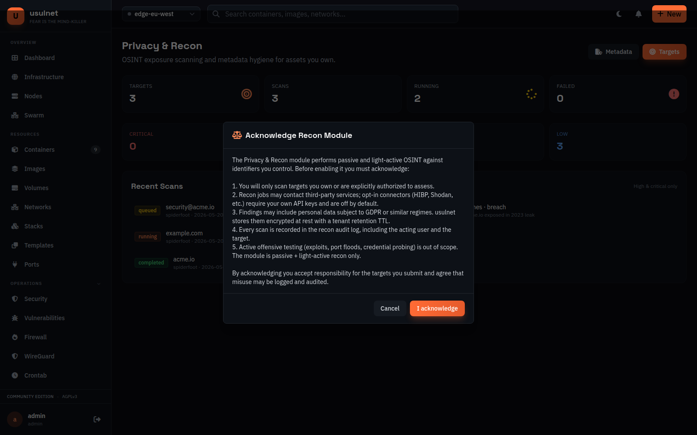
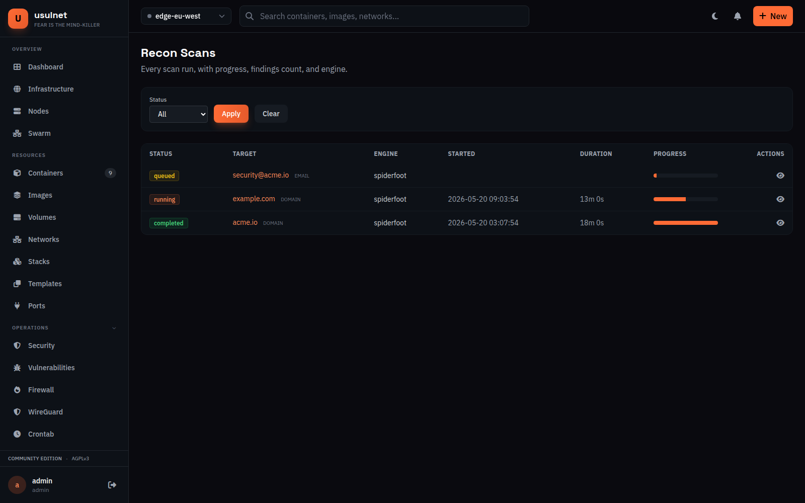
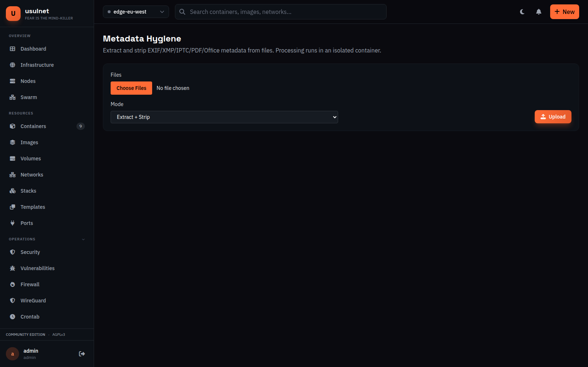

# RFC: Recon & Privacy Module (`recon`) — usulnet v26.5.0

**Status:** Draft — design only, no execution code yet.
**Target release:** v26.5.0 (first introduction), maturing across the v26.5.x series.
**Owner:** TBD
**License posture:** AGPL-3.0-or-later (matches the rest of usulnet).

---

## 1. Scope

This RFC introduces a first-class privacy / OSINT / metadata-hygiene module inside usulnet. It is **not** a separate binary, **not** a build-tag opt-in, and **not** an external plugin. It ships as part of the main `usulnet` binary so that the existing auth, RBAC, scheduler, repository, web UI, CLI, and NATS plumbing are reused as-is.

The module covers three user-facing capabilities:

1. **Metadata hygiene** — strip and/or extract EXIF/XMP/IPTC/PDF/Office metadata from files the user uploads or points to (e.g., a host filesystem path, a registry image layer, a volume).
2. **OSINT / privacy scanning** — given a target the user owns (an email, a phone, a domain, a username, an IP/CIDR), enumerate where that identifier is exposed publicly: breaches, public registrations, deep links / crawled endpoints, leaked credentials, social presence.
3. **Reports & data lake** — every finding lands in the usulnet PostgreSQL instance under a dedicated `recon` schema, queryable from the web UI and the CLI, exportable to JSON/CSV/PDF.

Everything in the module — engine, sidecar tools, dependencies — must be free software (AGPL/GPL/LGPL/MIT/BSD/Apache-2). No proprietary SaaS calls are made by default; opt-in connectors (e.g., HIBP, Shodan) require a user-supplied API key and are disabled until set.

### Out of scope (explicitly deferred)

- Active offensive testing (no exploits, no auth brute force, no port-flood scanning, no SQLi/XSS probing). The module is **passive + light-active recon only**.
- Targeting third-party identifiers without an ownership claim. See §7 (Legal / Ethics).
- Anonymization networks (no built-in Tor proxying in v26.5.0 — tracked as a v26.6 follow-up).

---

## 2. Why this fits inside usulnet

usulnet already operates Docker hosts. The recon module reuses that exact capability: every recon job runs inside an isolated container that usulnet itself manages. There is no new runtime, no new orchestration layer. From an architectural standpoint, recon is "yet another scheduler worker that launches yet another container", with persistence into the existing Postgres.

This also gives the privacy-minded self-hoster a single binary to deploy: container management + recon + metadata hygiene + reporting, all behind one auth boundary, one TLS endpoint, one backup story.

---

## 3. High-level architecture

```
                ┌──────────────────────────────────────────────────┐
                │                   usulnet (web + API)             │
                │  /recon UI  ·  /api/v1/recon/*  ·  CLI subcmds   │
                └───────────────┬──────────────────────────────────┘
                                │
                  ┌─────────────┴─────────────┐
                  │   internal/services/recon │
                  │   internal/services/metadata
                  └─────────────┬─────────────┘
                                │
                ┌───────────────┴──────────────┐
                │ scheduler/workers/recon_scan │
                │ scheduler/workers/metadata_job
                └───────────────┬──────────────┘
                                │ launches
                ┌───────────────┴──────────────────────────────┐
                │                                              │
   ┌────────────▼──────────────┐         ┌────────────────────▼───────────────┐
   │  usulnet/recon-spiderfoot │         │   usulnet/recon-toolkit             │
   │  (SpiderFoot OSS engine)  │         │   mat2 · exiftool · holehe ·        │
   │  speaks HTTP API to host  │         │   h8mail · phoneinfoga · katana ·   │
   │                            │         │   subfinder · pdfid · oletools    │
   └────────────┬──────────────┘         └────────────────────┬───────────────┘
                │ JSON findings                                │ JSON findings
                └───────────────┬──────────────────────────────┘
                                ▼
                ┌──────────────────────────────────────┐
                │ Postgres schema `recon`              │
                │ (targets, scans, findings, jobs,     │
                │  metadata_artifacts, audit_log)      │
                └──────────────────────────────────────┘
```

### Two containers, distinct responsibilities

| Image | Base | Purpose | Lifetime |
|-------|------|---------|----------|
| `usulnet/recon-spiderfoot:<ver>` | `debian-slim` + Python | Runs SpiderFoot (MIT) as a long-running service. usulnet talks to its HTTP API to start scans and pull results. | Long-running (one per node, restarted on upgrade). |
| `usulnet/recon-toolkit:<ver>` | `debian-slim` | Atomic tools the user invokes per-job: `mat2`, `exiftool`, `holehe`, `h8mail`, `phoneinfoga`, `katana`, `subfinder`, `pdfid`, `oletools`. | Short-lived (one container per job, removed on completion). |

Why split: SpiderFoot benefits from a warm process (module init, DB cache); atomic tools must run in disposable sandboxes for blast-radius reasons. Keeping them separate also keeps each image lean (<500 MB target).

### What we are explicitly **not** doing

- **Not** running Kali or BlackArch as a base. Both pull thousands of packages we don't use and increase attack surface. We pin specific versions of specific tools in our own slim image.
- **Not** invoking SpiderFoot's CLI per scan — we use its HTTP API so scans can be tracked, cancelled, and incremental.
- **Not** writing tool wrappers in Go that call shell commands directly on the host. Every tool runs in a container; usulnet only speaks to containers.

---

## 4. Data flow

### 4.1 Metadata job

1. User uploads a file (web UI) or supplies a path on a managed host (`/recon/metadata?host=<id>&path=...`).
2. Web handler creates a `metadata_jobs` row (status `queued`) and dispatches to scheduler.
3. `MetadataJobWorker` pulls the job, mounts the file read-only into a fresh `recon-toolkit` container, runs `exiftool -j` (extract) and optionally `mat2 --inplace --no-backup` on a copy (strip).
4. Worker parses the JSON output, inserts rows into `metadata_artifacts` and `metadata_findings`, sets job `completed`, and emits a notification event.
5. If the user requested "strip + download", the cleaned file is returned through usulnet's existing file-streaming endpoint and never persisted past the job TTL.

### 4.2 Recon scan

1. User defines a **target** (`recon_targets`) of type `email | phone | username | domain | ip | ip_range`. Targets must be linked to an **ownership proof** (see §7) before a scan can run.
2. User starts a **scan** (`recon_scans`) selecting a **profile** (a curated set of modules — e.g., "Email Exposure Lite", "Domain Surface", "Deep Crawl"). v26.5.0 ships four builtin profiles plus a full custom-profile CRUD API via `POST` / `PUT` / `DELETE /api/v1/recon/profiles` (builtin rows stay immutable, custom rows validate target types and modules against a closed catalogue).
3. `ReconScanWorker` calls the SpiderFoot container's HTTP API to start the scan with the selected modules. For modules SpiderFoot doesn't cover well (e.g., `mat2` for local files, `phoneinfoga` for phone numbers), the worker fans out additional jobs to the `recon-toolkit` container.
4. Worker polls SpiderFoot for events. For each new event, it normalizes into the `recon_findings` model and inserts/upserts. Heavy raw payloads land in `recon_findings_raw` (jsonb).
5. On scan completion, worker triggers a correlation pass (server-side SQL views) that produces a per-scan summary into `recon_scan_summary`.
6. Web UI/CLI subscribe to scan progress via the existing notification/SSE channel.

### 4.3 Reports

Reports are SQL-backed views materialized on demand:

- **Per-target dossier** — every finding for a target across all scans.
- **Per-scan report** — findings, top correlations, risk grading.
- **Tenant-wide exposure report** — aggregate counts (breaches found, leaked emails, exposed services).

Export formats: JSON (raw), CSV (flat findings), PDF (rendered via the existing report pipeline).

---

## 5. Database schema (overview, full SQL in migration `044`)

All recon tables live in the `public` schema with a `recon_` prefix, matching the existing usulnet migration conventions. (A dedicated PostgreSQL schema for least-privilege GRANT/REVOKE was considered but rejected to stay consistent with the rest of the codebase; it can be revisited as a v27 hardening item.)

| Table | Purpose | Key columns |
|---|---|---|
| `recon_targets` | Identifiers the user wants to scan | `id`, `tenant_id`, `type`, `value`, `value_hash`, `ownership_proof_id`, `created_by` |
| `recon_ownership_proofs` | DNS TXT / email verification challenges | `id`, `target_id`, `method`, `status`, `verified_at`, `evidence` |
| `recon_profiles` | Built-in & user-defined scan profiles | `id`, `name`, `kind` (`builtin`/`custom`), `modules` (jsonb) |
| `recon_scans` | One scan run | `id`, `target_id`, `profile_id`, `status`, `started_at`, `finished_at`, `engine_run_id`, `created_by` |
| `recon_findings` | Normalized findings | `id`, `scan_id`, `target_id`, `module`, `category`, `severity`, `value`, `confidence`, `first_seen`, `last_seen` |
| `recon_findings_raw` | Engine-native payload | `finding_id`, `engine`, `payload` (jsonb) |
| `recon_scan_summary` | Aggregated per-scan counts & grade | `scan_id`, `counts` (jsonb), `grade`, `correlations` (jsonb) |
| `recon_metadata_jobs` | Metadata strip/extract jobs | `id`, `tenant_id`, `source` (`upload`/`host_path`/`volume`), `source_ref`, `mode` (`extract`/`strip`/`both`), `status` |
| `recon_metadata_artifacts` | Files processed | `id`, `job_id`, `filename`, `mime`, `size`, `sha256`, `extracted` (jsonb), `stripped_sha256` |
| `recon_connectors` | Optional external API credentials (HIBP, Shodan, etc.) | `id`, `tenant_id`, `kind`, `credentials_encrypted`, `enabled` |
| `recon_audit_log` | Who did what, when, with what target | `id`, `actor_id`, `action`, `target_id`, `scan_id`, `ip`, `created_at` |

usulnet is single-tenant at the database layer (no `tenants` table exists today; multi-tenancy is enforced at the user/RBAC layer). The schema therefore scopes ownership by `created_by` referencing `users(id)` and matches the conventions used by recent migrations (e.g., `040_drift_detection`, `043_runbook_approvals`).

All `value` columns store identifiers in lowercased canonical form; `value_hash` is a `sha256` indexed instead of (or alongside) `value` to keep PII out of `pg_stat`/index dumps. Indexes follow the same partial-index pattern as the existing migrations (`WHERE status IN ('queued', 'running')` etc.). When DB-level multi-tenancy lands in a future major version, a follow-up migration will add `tenant_id` to recon tables.

GDPR right-to-erasure is honored by cascading deletes from `users` (for `created_by` chains) and, for findings tied directly to a target, from `recon_targets`. The audit log uses `ON DELETE SET NULL` so historical evidence of access is preserved when the underlying target is removed.

---

## 6. Service interfaces (Go)

Two new services land in this RFC, both with `ports.go` defining the public contract (no implementation files yet — those come in the v26.5.0 implementation PR).

```
internal/services/recon/
    ports.go           # ReconService, ScanEngine, Connector, ProfileResolver
    (impl in subsequent PR)

internal/services/metadata/
    ports.go           # MetadataService, MetadataExtractor, MetadataStripper
    (impl in subsequent PR)
```

The interfaces follow the existing usulnet conventions: constructor injection, context-first methods, no global state, all results return `(*Model, error)`, the service depends on a repository interface defined in the same package and implemented in `internal/repository/postgres/recon_repo.go` (also a follow-up).

The scheduler workers (`internal/scheduler/workers/recon_scan.go`, `metadata_job.go`) consume those interfaces and stay thin — they translate jobs into service calls.

CLI subcommands (`cmd/usulnet/recon.go`) reuse the same service interfaces over an in-process call (when the binary runs both server and CLI) or via the existing REST API client (when invoked from a remote machine). v26.5.0 ships the local case; remote CLI is v26.5.1.

---

## 7. Legal, ethics, and abuse-resistance

This is the part that determines whether the module is responsibly built.

### 7.1 Target ownership is enforced, not advisory

Before a scan can run against a `domain`, `email`, `ip`, or `ip_range` target, an **ownership proof** must be present and `verified`. Verification methods:

- **Domain** — DNS TXT record `usulnet-verify=<token>`.
- **Email** — a verification email with a one-time link.
- **IP / IP range** — RDAP/whois lookup match against the tenant's declared organization, OR an admin-signed "I own this range" attestation (logged in `audit_log`, requires `admin` RBAC).
- **Phone / username** — only "self-scan" is supported in v26.5.0; the verification is "you logged in and asserted this is yours". Phone scans against arbitrary numbers are blocked.

If verification is missing, the API/UI/CLI returns `403 ownership_required` and the scan never starts.

### 7.2 Rate limiting and engine constraints

- All recon jobs go through the existing scheduler with a dedicated worker pool (configurable concurrency, default 2).
- SpiderFoot is run with `__modules__` constrained per profile — modules that perform active probing (port scanning, intrusive HTTP) are excluded from default profiles and gated behind an admin-only flag.
- Outbound DNS / HTTP from the SpiderFoot container is rate-limited at the Docker network level (egress NetworkPolicy in the compose / agent).

### 7.3 Data retention & GDPR posture

- Findings carry a per-tenant retention TTL (default 90 days) configurable in usulnet settings.
- The existing usulnet "delete tenant" path cascades to recon tables.
- Raw payloads (`findings_raw`) are encrypted at rest using the existing AES-256-GCM helper from `internal/pkg/crypto`.
- The `recon.audit_log` table is append-only and survives target deletion (referential integrity via `target_id` is allowed to be `NULL`-on-delete).

### 7.4 Disclaimer & ToS

The module ships **disabled by default**. Enabling it via `config.yaml`/env (`USULNET_RECON_ENABLED=true`) requires an admin to acknowledge an in-app legal notice; the acknowledgement is logged. Without the flag, the API routes return `404` and the navigation entry is hidden — same pattern as the existing `enterprise` features.

---

## 8. CLI changes

Two new top-level subcommands on the main `usulnet` binary:

```
usulnet meta extract <path>          # print metadata JSON
usulnet meta strip <path> [-o out]   # write cleaned file
usulnet meta scan <dir> [--recursive]

usulnet recon target add <type> <value>
usulnet recon target verify <id>
usulnet recon profile list
usulnet recon scan start <target-id> --profile <name>
usulnet recon scan status <scan-id>
usulnet recon scan report <scan-id> [--format json|csv|pdf]
usulnet recon findings list --target <id> [--severity high]
```

Both subcommands share usulnet's existing Cobra root, RBAC checks, and logging. Output respects the existing `--output json|table|yaml` global flag.

CLI ergonomics targets:
- `usulnet meta strip ./photos/*.jpg` exits 0 with a one-line summary per file.
- `usulnet recon scan start … --watch` streams progress to the terminal via the same SSE channel the web UI uses.

---

## 9. Web UI changes

A new top-level section **Privacy & Recon** in the sidebar (hidden when the feature flag is off). Pages:

- `/recon/dashboard` — recent scans, exposure summary, top findings.

  

- `/recon/targets` — CRUD for targets, ownership verification flow.

  

- `/recon/scans` — scan list, live progress, cancel.
- `/recon/scans/:id` — findings table, filterable by module/severity, raw payload viewer.

  

- `/recon/metadata` — drag-drop file → preview metadata → optional strip + download.

  

- `/recon/connectors` — manage optional API keys (HIBP, Shodan, …) with the existing encrypted-secret pattern.

  

- `/recon/reports` — generated PDF/CSV exports.

  

All pages follow the existing Templ + HTMX + Alpine pattern; no new frontend frameworks introduced. Charts reuse the vendored Chart.js bundle.

---

## 10. API surface

Under `/api/v1/recon/`, mirroring the existing handler conventions:

```
POST   /api/v1/recon/targets
GET    /api/v1/recon/targets
GET    /api/v1/recon/targets/:id
DELETE /api/v1/recon/targets/:id
POST   /api/v1/recon/targets/:id/ownership/verify

GET    /api/v1/recon/profiles
POST   /api/v1/recon/scans
GET    /api/v1/recon/scans
GET    /api/v1/recon/scans/:id
DELETE /api/v1/recon/scans/:id              # cancel
GET    /api/v1/recon/scans/:id/findings
GET    /api/v1/recon/scans/:id/report.{json,csv,pdf}

POST   /api/v1/recon/metadata/jobs
GET    /api/v1/recon/metadata/jobs/:id
GET    /api/v1/recon/metadata/jobs/:id/stripped   # binary stream

GET    /api/v1/recon/connectors
PUT    /api/v1/recon/connectors/:kind             # set credentials
```

Middleware stack: existing JWT/API-key auth → recon-feature-flag middleware → RBAC. Default RBAC: `viewer` can list and read findings; `operator` can start scans; `admin` can manage connectors, profiles, and ownership overrides.

---

## 11. Threat model

| Threat | Mitigation |
|---|---|
| usulnet operator scans third-party identifiers without consent | Ownership verification gate; admin acknowledgement on enable; audit log of all scans |
| Tool container escapes to host | Run as non-root, read-only rootfs, no `--privileged`, no docker socket, dropped capabilities, seccomp default, ephemeral filesystems |
| Tool consumes excess bandwidth / triggers blocklisting | Scheduler concurrency cap, per-target rate limit, egress NetworkPolicy, ToS acknowledgement |
| PII/breach data leaks via logs | Logging redactor for `email`, `phone`, `password`, `hash` fields; raw payloads encrypted at rest |
| Stolen API keys (HIBP/Shodan) | Stored encrypted via existing AES-256-GCM helper; never returned in API responses; per-tenant isolation |
| Malicious uploaded file pwns mat2/exiftool | Files processed in single-shot, no-network, read-only-input container; output piped through size cap; known-CVE base image rebuilt monthly |
| Denial of service via large scan profiles | Profiles cap modules count and per-module timeout; tenant quota on concurrent scans |

---

## 12. Container images

Two image sources, each with its own CI pipeline:

- **SpiderFoot** — `deploy/recon/spiderfoot/Dockerfile`. Pulls upstream
  SpiderFoot at a pinned tag, runs as non-root, exposes 5001 internally
  only. Built by `.github/workflows/build-recon-images.yml` on every
  push to `main` that touches `deploy/recon/spiderfoot/`.
- **Toolkit** — `images/recon-toolkit/Dockerfile`. Bases on
  `archlinux:latest`. Built by `.github/workflows/recon-toolkit-weekly.yml`:

  - Monday 04:00 UTC cron rebuilds the image so arch + extra package
    updates land within a week of upstream.
  - `workflow_dispatch` for ad-hoc rebuilds (CVE response, etc.).
  - PR validation on changes under `images/recon-toolkit/`.
  - Gates: `docker build` succeeds, `smoke.sh` passes (every
    declared tool answers `--help`), compressed image size below the
    2.5 GiB ceiling.

  v26.5.2 initial-landing scope:
    - **arch core + extra**: `mat2`, `perl-image-exiftool` (exiftool),
      `yara`, plus python/pip support.
    - **pip-installed under `/opt/venv`**: `holehe`, `h8mail`,
      `oletools` (provides `olemeta`), `pdfid`.
    - Out of scope until a follow-up: BlackArch overlay and the wider
      OSINT/discovery tool set (`amass`, `subfinder`, `katana`,
      `nuclei`, etc.). The first three CI attempts to bootstrap
      BlackArch on top of `archlinux:latest` failed in the PR build
      job with no recoverable log; the follow-up PR adds the overlay
      with logs in hand.

  Tools managed by pacman are declared in
  `images/recon-toolkit/tools.list`. The same manifest is mirrored
  into `internal/services/recon/sandboxtools/tools.list` and surfaced
  in the operator UI at `/recon/connectors` under "Sandbox tools";
  `TestManifestInSync` guards against drift between the two copies.
  Python tools live in the venv at `/opt/venv` and are intentionally
  not in `tools.list` — the catalogue surfaces what pacman manages.

  **Platform**: the toolkit image is `linux/amd64` only — the official
  `archlinux` Docker image is x86_64-only. arm64 hosts can either
  (a) set `recon.toolkit.image` to a custom multi-arch alternative or
  (b) disable the recon module via `recon.enabled: false`. The prior
  Debian-slim toolkit at `deploy/recon/toolkit/` has been removed in
  favour of the Arch path.

Image references are pinned in `internal/services/recon/images.go` to
a specific digest. CI opens a PR (`peter-evans/create-pull-request`)
that rewrites the digest constants whenever a new build lands on
`main`, keeping the Go binary tracking the exact image it should pull.

---

## 13. Configuration

New top-level section in `config.yaml`:

```yaml
recon:
  enabled: false
  spiderfoot:
    image: ghcr.io/fr4nsys/usulnet-recon-spiderfoot@sha256:...
    listen: 127.0.0.1:5001
  toolkit:
    image: ghcr.io/fr4nsys/usulnet-recon-toolkit@sha256:...
  retention_days: 90
  max_concurrent_scans: 2
  egress:
    allowlist: []          # empty = default (public internet allowed, egress NetworkPolicy applies)
  connectors:
    hibp:    { enabled: false }
    shodan:  { enabled: false }
```

All values overridable via `USULNET_RECON_*` env vars, following the existing Viper convention.

### 13.1 Connectors

Connectors are optional external-API integrations under
`internal/services/recon/connectors/`. Each one ships as a
self-contained package implementing `recon.Connector`
(`Kind` / `Enabled` / `HealthCheck`). All connectors are
**bring-your-own-key** — the AGPL binary never bundles credentials,
and a connector is registered at startup only when the corresponding
`recon.connectors.<kind>.enabled` toggle is `true`. Credentials are
managed by the operator via the `/recon/connectors` UI or the
`PUT /api/v1/recon/connectors/{kind}` API; the credential row in
`recon_connectors` is encrypted at rest with the installation-wide
AES-256-GCM data key.

#### Have I Been Pwned (HIBP)

- **Kind:** `hibp`
- **Targets covered:** `email`
- **Free tier:** none — HIBP's v3 API requires a paid subscription
  (~$3.95/mo "Pwned 1" plan as of writing). Higher tiers raise the
  per-key rate limit.
- **Rate limit:** 1.5 seconds between requests for a single key.
  The connector does not pace requests itself; callers should
  back off on `ErrRateLimited` (429).
- **Configure via UI:** Recon → Connectors → "Have I Been Pwned"
  card → paste API key → Save.
- **Configure via API:** `PUT /api/v1/recon/connectors/hibp`
  body `{"enabled": true, "credentials": {"api_key": "<value>"}}`.
- **Configure via env (boot-time only):**
  `USULNET_RECON_HIBP_API_KEY=<value>` — kept as a migration grace
  for installs that predate the credential store.
- **Error semantics:** `ErrNoAPIKey` (no key set), `ErrUnauthorized`
  (401 — bad key), `ErrRateLimited` (429), `ErrUnexpectedStatus`
  (any other non-2xx).

#### Shodan

- **Kind:** `shodan`
- **Targets covered:** `ip`, `domain` (hostname), `ip_range` (CIDR).
  - `ip` → `GET /shodan/host/{ip}` — emits one finding per
    observed service/port on the host.
  - `domain` → `GET /dns/resolve?hostnames=<host>` — emits one
    finding per resolved IP (info severity); follow up with an
    `ip`-kind lookup to enumerate services.
  - `ip_range` → `GET /shodan/host/search?query=net:<cidr>` —
    emits one finding per match, capped at
    `shodan.MaxSearchResults` (100) to bound query-credit burn.
- **Free tier:** Shodan offers a free account whose API key only
  exposes `/api-info` and a limited set of read endpoints. The
  paid "freelancer" tier (~$69/mo as of writing) unlocks
  `/shodan/host/search` and grants query credits. The connector
  works with both tiers — search-only paths will fail with
  `ErrUnauthorized` on a free key.
- **Rate limit:** ~1 request per second per key on freelancer.
  Each `/shodan/host/{ip}` and `/shodan/host/search` call
  consumes 1 query credit; `/dns/resolve` and `/api-info` are
  free. The connector does not pace requests itself; callers
  should back off on `ErrRateLimited` (429).
- **Configure via UI:** Recon → Connectors → "Shodan" card →
  paste API key → Save.
- **Configure via API:** `PUT /api/v1/recon/connectors/shodan`
  body `{"enabled": true, "credentials": {"api_key": "<value>"}}`.
- **Configure via env (boot-time only):**
  `USULNET_RECON_SHODAN_API_KEY=<value>`.
- **HealthCheck:** `GET /api-info` with the configured key;
  asserts a 200 whose body decodes to a struct carrying the
  documented `query_credits` field. Burns no credits.
- **Error semantics:** `ErrNoAPIKey`, `ErrUnauthorized` (401 or
  403), `ErrRateLimited` (429), `ErrUnexpectedStatus`,
  `ErrUnsupportedTarget` (kind outside `{ip, domain, ip_range}`),
  `ErrInvalidTargetValue` (empty value, malformed IP, malformed
  CIDR), `ErrUnhealthyResponse` (HealthCheck 200 with no
  `query_credits` in the body).
- **Overlap with SpiderFoot:** SpiderFoot ships an `sfp_shodan`
  module that consumes the same key. Operators who have already
  configured their key inside SpiderFoot do not need this
  connector — it is the BYO-key fallback for installs where
  `sfp_shodan` is unconfigured.

---

## 14. Migration & rollout plan

1. **v26.5.0** *(launch)* — RFC frozen; migration `044`/`045`; service implementation; SpiderFoot + toolkit Docker images; metadata strip/extract end-to-end; CLI subcommands; web UI dashboard + metadata page; HIBP connector with encrypted-at-rest credentials; four builtin scan profiles **plus** full user-defined custom-profile CRUD; JSON, CSV and PDF report formats. Feature flag off by default.
2. **v26.5.1+** — Phone (PhoneInfoga) and deep-crawl (katana/subfinder) profiles, remote CLI mode, connector ecosystem (Shodan, IntelX, etc.), correlation graph view, Postgres FTS over findings, optional Tor egress for SpiderFoot.

---

## 15. Open questions

- Do we ship the SpiderFoot image as a usulnet-built derivative or as a thin manifest pointing at the upstream image? Building ourselves gives reproducibility and lets us pin a CVE-patched base; the cost is CI time.
- Per-tenant or global recon-toolkit image cache? Global is simpler but couples upgrade cycles across tenants.
- How aggressive should the default findings TTL be? GDPR says "no longer than necessary"; 90 days is a starting point but should be challenged.
- Should we expose a "recon webhook" so downstream systems (SIEMs, ticketing) get findings pushed? Cheap to add and lots of value.

---

## 16. Non-goals reaffirmed

- This module does **not** turn usulnet into a pentesting platform.
- This module does **not** automate "delete my data" requests to third parties (that's Incogni's actual business; we can produce the dossier but not the takedowns — tracked separately if there is demand).
- This module does **not** call SaaS APIs without explicit per-connector configuration.

---

## 17. References

- SpiderFoot (MIT): https://github.com/smicallef/spiderfoot
- mat2 (LGPL-3): https://0xacab.org/jvoisin/mat2
- ExifTool (Artistic): https://exiftool.org/
- holehe (GPL-3): https://github.com/megadose/holehe
- h8mail (BSD-3): https://github.com/khast3x/h8mail
- PhoneInfoga (GPL-3): https://github.com/sundowndev/phoneinfoga
- katana / subfinder (MIT, ProjectDiscovery): https://github.com/projectdiscovery
- oletools (BSD-2): https://github.com/decalage2/oletools
