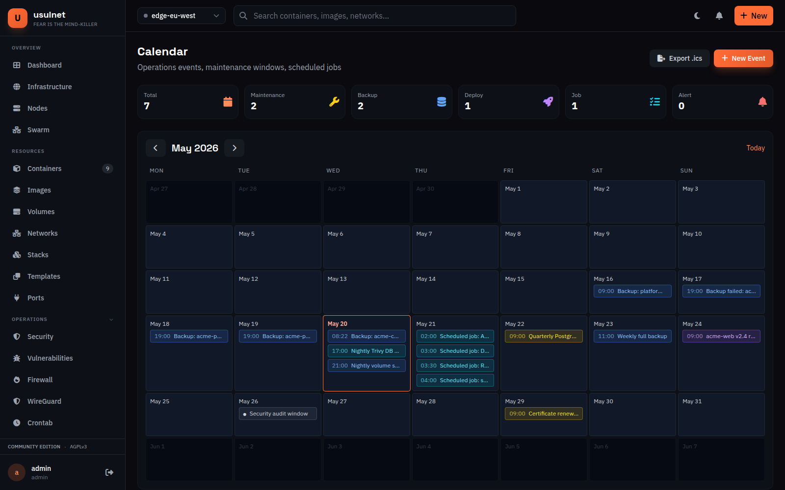
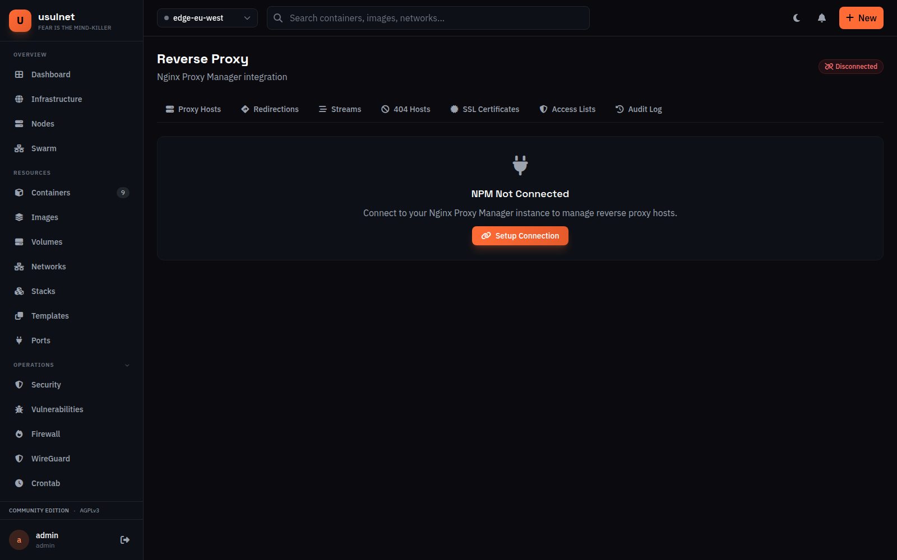
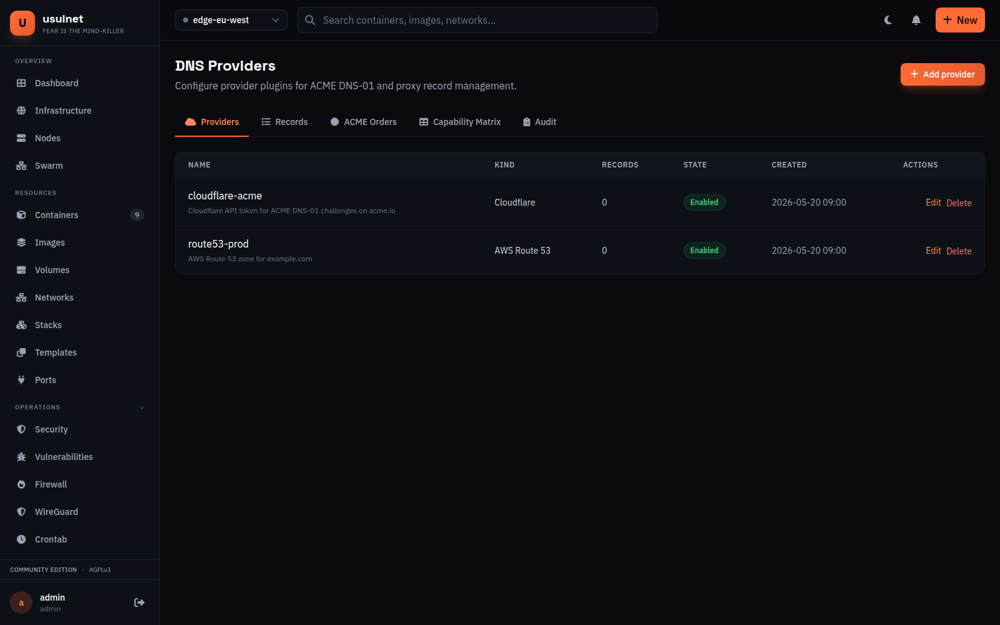
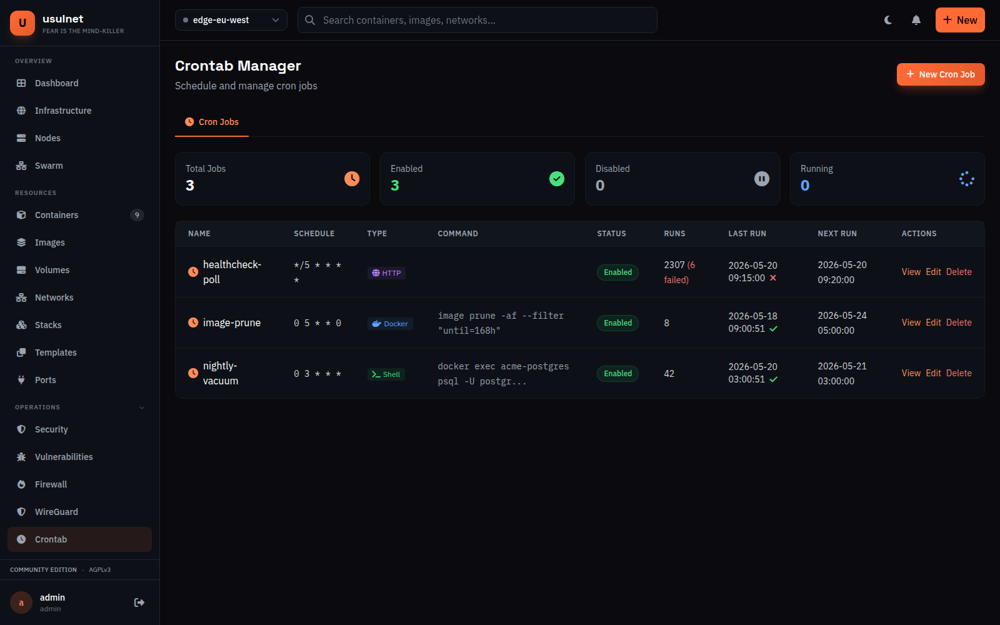
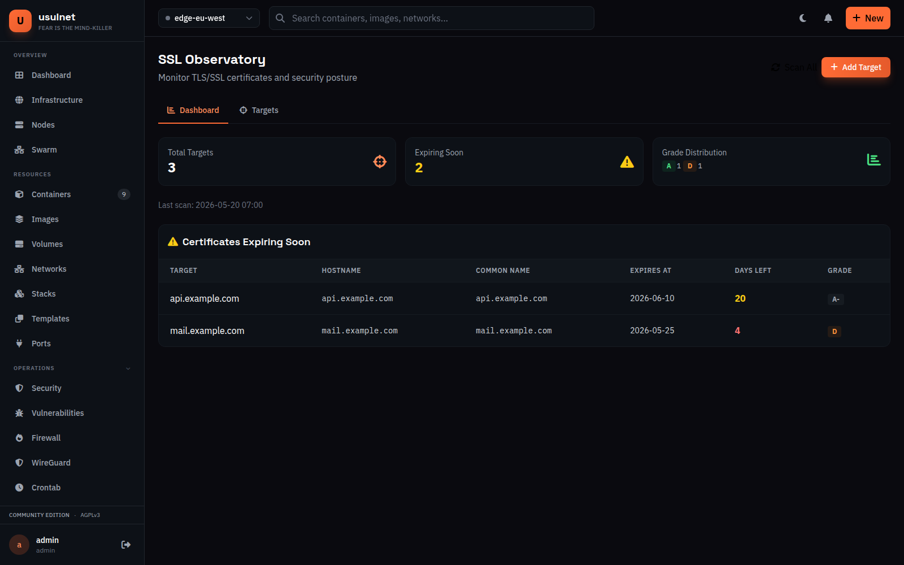
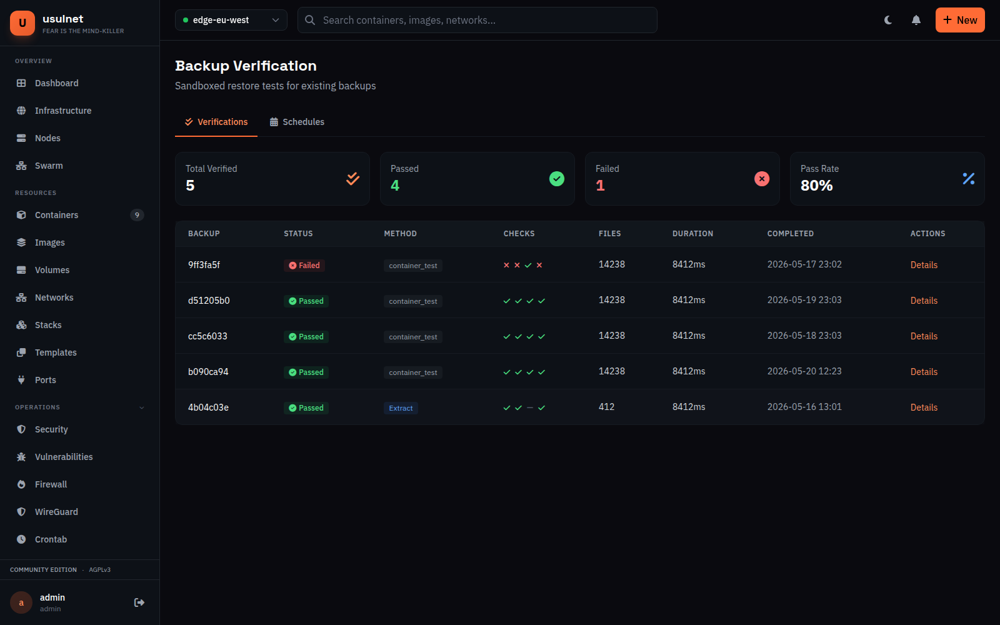
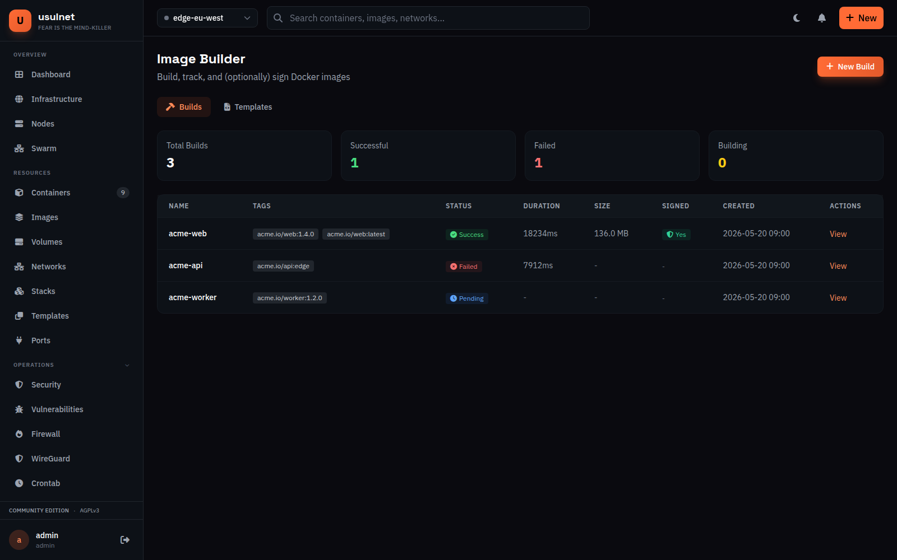
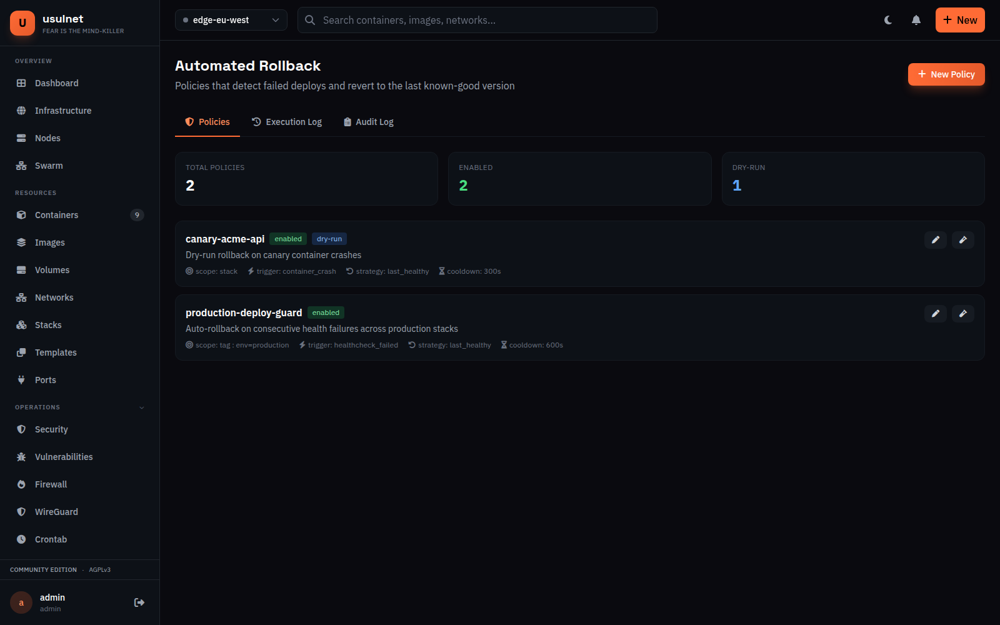
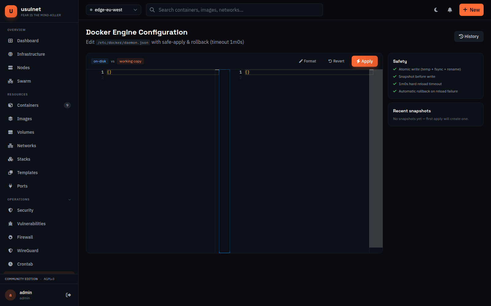

# usulnet v26.5.1 — release notes

**Release date:** 2026-05-15
**Headline:** 11 modules formerly biz-gated now ship in the AGPL build.

v26.5.1 finishes what v26.5.0 started: "one AGPL build, all features."
The release ports the v26.2.7 Business-edition module set into the
standard self-hosted binary, removes the last `isEditionAvailable` /
`navItemLocked` / `RequireFeature` callsites, and drops the
node-count / user-count / API-key resource caps that the Community
edition used to enforce. No feature is gated by a paid license tier;
no telemetry leaves the binary; no closed-source extension point exists.

The eleven ported modules are listed below in the order they appear in
the navigation. Per-PR detail and screenshots live in the per-session
PRs referenced in
[`docs/v26.5/v26.5.1-ported-modules.md`](v26.5.1-ported-modules.md);
the full per-feature changelog is in
[`CHANGELOG.md`](../../CHANGELOG.md) under `[v26.5.1] — 2026-05-15`.

## Modules added

### 1. Calendar (Tools → Calendar)



Operations calendar with manual event entry plus a read-only
`EventSource` aggregator that surfaces backup runs and scheduled jobs
without duplicating their tables. REST CRUD at
`/api/v1/calendar/events`, range queries capped at 366 days, RFC 5545
iCalendar export at `/export.ics`. Migration `046_calendar.up.sql`
indexes `(starts_at, ends_at)` for range queries; the `kind` column is
constrained to a strict allow-list so the table cannot become a junk
drawer.

Session 11 PR: [#66](https://github.com/fran-olivares/usulnetdevbeta04/pull/66).

### 2. Proxy extended (Networking → Proxy)


Access lists, dead hosts, locations, redirections, and streams now
live in PostgreSQL with usulnet as the authoritative state. The
proxy service pushes the extended state to the active backend on
apply via the new `ExtendedSyncBackend` interface. nginx reports full
feature support; Caddy reports `streams=false` and surfaces a clear
`422 FEATURE_NOT_SUPPORTED` instead of a generic 500. Access-list
precedence (explicit deny > explicit allow > default) is pinned by a
table-driven test covering IPv4 literals, IPv4 CIDR, IPv6 literals,
IPv6 CIDR, and the literal "all". Migration `047_proxy_extended.up.sql`.



Session 09 PR: [#64](https://github.com/fran-olivares/usulnetdevbeta04/pull/64).

### 3. DNS providers (Integrations → DNS Providers)



Thin plugin layer over Cloudflare, AWS Route 53, DigitalOcean (direct
HTTP — no vendor SDK), and any RFC 2136 nameserver (TSIG-authenticated
UPDATE messages via `github.com/miekg/dns`). ACME DNS-01 flow is a
persistent state machine that survives restarts. Provider credentials
are AES-256-GCM encrypted at rest with `USULNET_ENCRYPTION_KEY`. New
permissions `dns:view`/`dns:write`. Migration `048_dns.up.sql`.

> The v26.2.7 embedded miekg/dns authoritative server and zone editor
> are intentionally **not** ported — v26.5.1 ships a provider plugin
> layer only. Provider plugins are explicit (`dns/providers.RegisterAll`
> at boot; no init-time drift).

Session 10 PR: [#65](https://github.com/fran-olivares/usulnetdevbeta04/pull/65).

### 4. Crontab (Operations → Crontab)



Managed cron jobs (shell / docker / http types) scheduled with
`github.com/robfig/cron/v3` — the same parser the rest of the codebase
already depends on. REST CRUD, run-now, toggle, paginated executions
(default 100/page), WebSocket `/executions/tail` for live updates.
Docker command type now executes (v26.2.7 returned "not supported").
HTTP response body capped at 64 KiB. New `crontab:view` /
`crontab:execute` permissions. Migration `049_crontab.up.sql`.


Session 02 PR: [#57](https://github.com/fran-olivares/usulnetdevbeta04/pull/57).

### 5. Firewall (Operations → Firewall)


UFW / nftables / iptables rule management with web UI and REST API
(`/api/v1/firewall/*`). Service runs through the existing
host-management transport — argument slices on the agent side; the
master never shells out. Closed-enum validation
(chain/action/protocol/direction) returns typed `ErrInvalidInput`;
comment preview uses `strconv.Quote` to defend the audit log against
log-injection. Migration `050_firewall.up.sql`.

Capability requirement: the agent process needs **`NET_ADMIN`** on the
host. See [`docs/installation.md`](../installation.md#firewall-firewall).

Session 01 PR: [#56](https://github.com/fran-olivares/usulnetdevbeta04/pull/56).

### 6. SSL observatory (Operations → SSL Observatory)



Periodic in-process TLS scanning, certificate health grading,
per-target alert thresholds (default 30/14/7/3/1 days), SNI virtual-
host scans (one `scan_result` row per `(target, hostname)`), daily
04:00 UTC scheduled sweep via the new `JobTypeSSLScan` worker. Every
TLS dial has a hard 10 s timeout. Cert-expiry alerts route through the
notification service via a narrow `Notifier` interface. Migration
`051_ssl_observatory.up.sql`.

Session 05 PR: [#60](https://github.com/fran-olivares/usulnetdevbeta04/pull/60).

### 7. Backup verification (Operations → Backup Verify)



Scheduled + on-demand restore tests for existing backups. Sandboxed
execution via the recon launcher (read-only rootfs, dropped caps,
no-new-privileges, default seccomp, non-root UID 65534, 512 MiB /
1 vCPU / 256 PIDs caps, dedicated egress-controlled bridge network).
Per-installation encryption keys passed to verification containers via
a **tmpfs file mount** — never an environment variable that would
appear in `docker inspect`. Real checksum + extract via the
backup-service `Verify` pipeline (v26.2.7 returned heuristic
"1 file per ~10 KiB" file counts). Migration
`052_backup_verification.up.sql`.

Session 03 PR: [#58](https://github.com/fran-olivares/usulnetdevbeta04/pull/58).

### 8. Image builder (Operations → Image Builder)



Local Dockerfile build pipeline with live log streaming. Daemon output
streams through Redis pub/sub on `imagebuilder:logs:<id>` channels; a
per-build subscriber bridges the daemon's NDJSON into the API's
WebSocket and SSE endpoints. Build context uploads are capped at a
configurable 256 MiB (`image_builder.max_context_bytes`); 413 on
overflow. Trailing 64 KiB of the log persists to
`image_build_jobs.output` so the table view stays bounded regardless
of how chatty a build was. Seven AGPL-compatible starter Dockerfile
templates ship in the binary (alpine-minimal, static-web-nginx,
node-app, python-app, go-app, postgres-extension, background-worker).
Optional cosign hook (`image_sign.enabled=true`) signs successful
builds via the existing `imagesign` service. Migration
`053_image_builder.up.sql`.


Session 08 PR: [#63](https://github.com/fran-olivares/usulnetdevbeta04/pull/63).

### 9. Automated rollback (Operations → Rollback)



Automated revert to the last known-good stack version on failed
deploy. Event-driven via the new `changes.Service.Subscribe` API
(replaces v26.2.7's 1-minute poll). `last_healthy` strategy walks the
stack version history for `is_deployed && deployed_at` (replaces
v26.2.7's naive "previous version" assumption). Per-stack
`sync.Mutex` lock prevents racing manual deploys; cooldown window
protects against flapping. Dry-run endpoint at
`POST /api/v1/rollback/policies/{id}/dry-run`. Audit log is
append-only via a Postgres trigger plus a static guard test mirroring
the recon pattern. Migration `054_automated_rollback.up.sql`.


Session 04 PR: [#59](https://github.com/fran-olivares/usulnetdevbeta04/pull/59).

### 10. WireGuard (Operations → WireGuard)


Peer + interface manager extended into a master→agent mesh over the
existing NATS gateway. Real Curve25519 public keys (`curve25519.X25519`
— v26.2.7 generated a placeholder by XOR-ing the private key, which
never interoperated with a real client). Private + preshared keys and
the rendered client config are AES-256-GCM encrypted at rest with
`USULNET_ENCRYPTION_KEY`. One-time QR endpoint with 5 min TTL. New
`wireguard_mesh_links` table records `(peer, agent)` application
status. Hard timeouts on every `wg`/`wg-quick` invocation; preshared
keys piped on stdin so they never appear in argv. Migration
`055_wireguard_vpn.up.sql`.


Capability requirements: WireGuard kernel module on each agent host,
`wg`/`wg-quick` on `PATH`, and **`NET_ADMIN`** on the agent process.
See [`docs/installation.md`](../installation.md#wireguard-wireguard).

Session 07 PR: [#62](https://github.com/fran-olivares/usulnetdevbeta04/pull/62).

### 11. Marketplace (Integrations → Marketplace)


Curated app marketplace with offline-first catalogue and local-only
reviews. App templates ship under
`internal/templates/marketplace/<slug>/{manifest.yaml,compose.yaml,icon.svg}`
and are baked into the binary via `go:embed`. **Zero outbound HTTP at
runtime** — `TestStart_NoOutboundCalls` wires
`http.DefaultTransport` to fail every dial and asserts
`HydrateCatalog` issues none. Reviews never leave the instance; the
unique `(user_id, app_id)` constraint is paired with a repository-level
`Upsert` so a user revising their review collapses to one row instead
of racing. Install action wires through the existing stack service;
the new `stack_id` is stored on the installation row so the
installed-apps page can link back. Migration `056_marketplace.up.sql`.


Session 12 PR: [#67](https://github.com/fran-olivares/usulnetdevbeta04/pull/67).

## Bonus: docker engine config (Operations → Docker Engine)



Editor for `/etc/docker/daemon.json` with atomic writes (temp + `fsync`
+ `rename`), snapshot history with rotation (default keep 50), and
reload-with-rollback under a hard 60 s timeout. **No DB migration** —
v26.2.7 had none; the snapshot history lives on disk under
`/etc/docker/usulnet-snapshots/`. v26.2.7's 898-LoC monolithic
`service.go` is split into `reader.go`, `writer.go`, `applier.go`, and
a thin `service.go` so each leg of the apply cycle is independently
unit-testable. v26.2.7's nsenter-via-`docker exec` self-exec path is
intentionally **not** ported — operators volume-mount the host's
`/etc/docker` into the usulnet container as `:rw` instead.


Capability requirement: bind mount `/etc/docker` into the usulnet
container with `:rw`. See
[`docs/installation.md`](../installation.md#docker-engine-config-docker-engine).

Session 06 PR: [#61](https://github.com/fran-olivares/usulnetdevbeta04/pull/61).

## Edition cleanup

Session 13 removes the last edition-gating callsites:

- The `isEditionAvailable("biz")` and `navItemLocked` template calls in
  `internal/web/templates/partials/sidebar.templ`.
- The `requireFeature` web middleware along with its 27 callsites in
  `internal/web/routes_frontend.go`.
- The API enforcement middleware `RequireFeature` / `RequirePaid` /
  `RequireEnterprise` / `RequireLimit` plus every callsite in
  `internal/api/handlers/`.
- Service-level `limitProvider` enforcement in `team`, `user`, `host`,
  `git`, `storage`, `notification`, and `backup`. Operator-controlled
  caps via `Config.Max*` remain.
- The `apierrors.LicenseRequired` / `LicenseExpired` / `FeatureDisabled`
  helpers and the `pkg/errors.LimitExceeded` helper plus their
  matching error codes (`LICENSE_REQUIRED` / `LICENSE_EXPIRED` /
  `FEATURE_DISABLED` / `LIMIT_EXCEEDED`). Only `LICENSE_INVALID`
  survives — it tags JWT cryptographic-validation failures.
- The hard-coded Community-edition resource caps. `license.CELimits()`
  no longer caps `MaxNodes=1` / `MaxUsers=3` / `MaxAPIKeys=3` etc.; it
  is replaced by `license.OpenLimits()` which returns the zero value of
  `Limits` (all unlimited). `license.AllBusinessFeatures()` and
  `license.AllEnterpriseFeatures()` collapse into a single
  `license.AllFeatures()`.
- The license-tier comparison table on the in-product License page.
  The page now shows the AGPL banner, the instance fingerprint, and an
  optional support-token activation form whose copy clarifies the
  token only records a support contract — it does not unlock features.

The `Sidebar(...)` signature still accepts `edition` / `editionName` so
existing call sites do not change, but the parameters are unused. The
`Edition` constants (`CE` / `Business` / `Enterprise`) and their
`EditionName()` accessor are intentionally preserved so previously-
issued commercial JWTs remain parseable.

## Bootstrap restructure

Session 14 splits the ~2,700-line `internal/app/app.go`
`startStandalone` into phased `init_*.go` files (server, auth, docker,
services, scheduler, api, web) backed by a shared `initContext`.
`app.go` is now a thin orchestrator that delegates to each phase. No
behaviour change; recon + metadata wirings are preserved.

`scripts/verify-migrations.sh` is strengthened to reject gaps,
duplicates, and unpaired up.sql/down.sql files. Ships with
`scripts/verify-migrations_test.sh`.

## Optional: local-services TLS

`USULNET_TLS_LOCAL_SERVICES=true` opt-in flag wires self-signed
ECDSA P-256 certificates (3650 days) onto Postgres, Redis, and NATS.
The application detects the flag at boot and rewrites the connection
schemes (`postgres sslmode=require`, `rediss://`, NATS with
`nats.Secure(...)`). Defaults are unchanged — with the flag off, the
entrypoint dispatchers exec the upstream binaries with no TLS material
on disk, plain-TCP behaviour on the private `usulnet-backend` Docker
network is preserved. Docs:
[`docs/installation.md`](../installation.md#optional-tls-for-in-cluster-postgres--redis--nats).

The managed `usulnet-nginx` container from v26.2.7 is **not**
re-introduced; v26.5.0's external-proxy posture (NPM/Caddy
integration) stays as the default reverse-proxy story.

## Security

Session 15 hardening audit recorded in
[`docs/v26.5/security-review-v26.5.1.md`](security-review-v26.5.1.md),
mirroring the v26.5.0 baseline structure.

- **External port surface unchanged.** Only HTTPS (`7443`) is published
  to the host by default; HTTP (`8080`) is commented out and used
  internally for health checks. NATS (`4222`) stays on the private
  `usulnet-backend` Docker network. None of the eleven new modules
  opens an external port.
- **No call-home.** A repo-wide grep for `usulnet.com` endpoints inside
  `internal/` returns only three matches — a HIBP `User-Agent` string,
  an iCal UID suffix per RFC 5545, and NATS subject prefixes. None
  initiates a connection to a usulnet-controlled endpoint.
- **No new privileged mount.** Session 14's opt-in local-services TLS
  introduces three read-only mounts of `./deploy/tls:/usulnet-tls:ro`
  on postgres / redis / nats. The mounts are inert when
  `USULNET_TLS_LOCAL_SERVICES=false` (the default). The Docker socket
  is still mounted only into the usulnet container and the optional
  usulnet-agent container — never into a recon sandbox, a user-built
  image, or any of the new modules' workers.
- **No new capability added to the usulnet container.** Existing
  `cap_add: [SYS_PTRACE, SYS_ADMIN]` is unchanged. Modules that touch
  the host (firewall, WireGuard, docker-engine config, image builder)
  reach it through the existing host-management SSH transport or the
  already-mounted Docker socket rather than requesting `NET_ADMIN` /
  `NET_RAW` / `SYS_ADMIN` for themselves.
- **govulncheck in CI.** `.github/workflows/govulncheck.yml` runs
  `scripts/govulncheck.sh` on every push to `main` and every PR.
  Dependency bumps in v26.5.1 (Go toolchain 1.25.7 → 1.25.10, pgx
  5.7.2 → 5.9.2, NATS 1.39.1 → 1.52.0, go-redis 9.7.0 → 9.19.0,
  go-chi 5.2.2 → 5.2.5, jwt 5.2.2 → 5.3.1, go-oidc 3.17.0 → 3.18.0,
  go-ldap 3.4.12 → 3.4.13, docker 28.5.1 → 28.5.2) cover every CVE
  surfaced by the first CI run. Two unfixed Moby findings
  (`GO-2026-4883`, `GO-2026-4887`) are in the allowlist with inline
  justification — both are daemon-side defects in plugin install paths
  that usulnet does not exercise.

## Upgrade path

v26.5.0 → v26.5.1 is **migration-additive only**. Eleven new tables
join the schema; no destructive `ALTER` runs against an existing
v26.5.0 table, and the v26.5.0 `recon_*` schema (044/045) is untouched.
Operators can roll forward by pulling the new image and restarting:

```bash
docker compose pull
docker compose up -d
```

The first start of v26.5.1 applies migrations 046–056 in order. The
`scripts/verify-migrations.sh` check is part of `make quality` and
asserts no gap, no duplicate, no orphan up.sql/down.sql.

No application config key is removed. New keys default to safe values
(see [`docs/installation.md`](../installation.md#v2650--v2651)).

## Rollback

If you need to revert to v26.5.0, drop the eleven new migrations in
reverse order before downgrading the binary:

```bash
usulnet migrate down 11
```

Or, for an explicit per-step rollback, run the individual `down.sql`
files in reverse:

```sql
-- 11. marketplace
\i internal/repository/postgres/migrations/056_marketplace.down.sql
-- 10. wireguard
\i internal/repository/postgres/migrations/055_wireguard_vpn.down.sql
-- 9.  automated rollback
\i internal/repository/postgres/migrations/054_automated_rollback.down.sql
-- 8.  image builder
\i internal/repository/postgres/migrations/053_image_builder.down.sql
-- 7.  backup verification
\i internal/repository/postgres/migrations/052_backup_verification.down.sql
-- 6.  ssl observatory
\i internal/repository/postgres/migrations/051_ssl_observatory.down.sql
-- 5.  firewall
\i internal/repository/postgres/migrations/050_firewall.down.sql
-- 4.  crontab
\i internal/repository/postgres/migrations/049_crontab.down.sql
-- 3.  dns
\i internal/repository/postgres/migrations/048_dns.down.sql
-- 2.  proxy extended
\i internal/repository/postgres/migrations/047_proxy_extended.down.sql
-- 1.  calendar
\i internal/repository/postgres/migrations/046_calendar.down.sql
```

The v26.2.7 module schemas are independent enough that rolling back
in this order is safe; no foreign-key chain crosses a module
boundary. Verify with:

```bash
usulnet migrate status
```

After the rollback, redeploy the v26.5.0 image. v26.5.0 ignores
unknown columns it does not know about; the `recon_*` schema is
untouched by the v26.5.1 ports so v26.5.0 continues to operate on
its own tables.

## Capability requirements (recap)

| Module | Capability / mount needed |
| --- | --- |
| firewall | `NET_ADMIN` on the agent process; `ufw`/`nft`/`iptables` on the host |
| WireGuard | WireGuard kernel module + `wg`/`wg-quick` on the agent host; `NET_ADMIN` on the agent process; `USULNET_ENCRYPTION_KEY` set on the master |
| image builder | Docker socket mount (already required by the platform); optional `image_sign.enabled=true` to wire cosign |
| docker engine config | Host `/etc/docker` bind-mounted into the usulnet container as `:rw` |
| backup verification | Docker socket mount (already required); the recon sandbox launcher does the rest |
| dns providers | Outbound egress to the chosen provider's API endpoint; `USULNET_ENCRYPTION_KEY` set |

All other v26.5.1 modules (crontab, rollback, SSL observatory,
calendar, marketplace, proxy-extended) need nothing beyond the
default compose stack.

## No breaking changes

- No removed API endpoint.
- No removed config key.
- No removed CLI subcommand.
- No removed permission key.
- No destructive schema change against an existing table.

The `Sidebar(...)` template signature still takes `edition` /
`editionName`; the `Edition` constants and `EditionName()` accessor
still parse v26.2.7 commercial JWTs. The values are display-only —
they do not gate any feature.

## Acknowledgements

The v26.2.7 → v26.5.1 port took fifteen sessions of review, verify,
improve, optimize, and integrate. Status board in
[`docs/v26.5/v26.5.1-ported-modules.md`](v26.5.1-ported-modules.md);
per-feature changelog in [`CHANGELOG.md`](../../CHANGELOG.md).

The upstream projects we lean on: `robfig/cron/v3` for the crontab
parser, `miekg/dns` for RFC 2136 TSIG-authenticated UPDATE messages,
`golang.org/x/crypto/curve25519` for real WireGuard key derivation,
`aws-sdk-go-v2/service/route53` for the Route 53 plugin, and the
existing recon sandbox launcher for backup verification.
